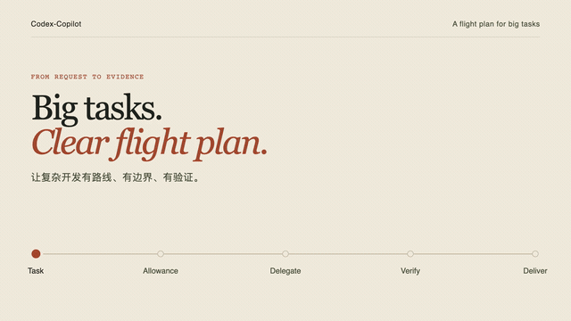

# Codex-Copilot

[](https://openai.com/codex/)
[](pyproject.toml)
[](LICENSE)

**给大任务准备的一位友好空管。** 它帮助 Codex 判断：什么时候该请子代理、什么时候该专注自己做，以及该为最终验证留下多少 token。

[English](README.md)

> 面向 Windows、macOS 和 Linux 上的 **Codex Desktop**。要求 Python 3.11+、Codex CLI 0.147.0+。

## 项目演示

<p align="center">
  <a href="https://github.com/EricArcha/Codex-Copilot/raw/refs/heads/main/videos/codex-copilot-demo/exports/codex-copilot-intro-web.mp4">
    
  </a>
</p>
<p align="center">
  <a href="https://github.com/EricArcha/Codex-Copilot/raw/refs/heads/main/videos/codex-copilot-demo/exports/codex-copilot-intro-web.mp4"><strong>播放有声版 · MP4</strong></a>
  &nbsp; · &nbsp;
  <a href="https://github.com/EricArcha/Codex-Copilot/raw/refs/heads/main/videos/codex-copilot-demo/exports/codex-copilot-intro-master.mp4">1080p · 60fps</a>
</p>
<p align="center"><sub>24 秒，从任务请求走到有证据的交付。GIF 预览无声。</sub></p>

## 稳定版本：1.0.0

Codex-Copilot 1.0.0 建立了安装、CLI/JSON 兼容性及发布边界。参见[正式版本](https://github.com/EricArcha/Codex-Copilot/releases/tag/v1.0.0)、[变更记录](CHANGELOG.md)、[兼容承诺](docs/compatibility.md)、[发布规则](docs/releasing.md)和[贡献入口](CONTRIBUTING.md)。

Codex-Copilot 现已采用 GPT-6 分层路由：**Luna** 用于定向探索，也是默认子代理；**GPT-6.1 Sol** 负责常规开发与审查；**Astra** 仅用于 premium 的 L3 高风险任务和最终审查。已完成完整安装的用户，请先将源码仓库更新到此版本，再运行 `./bin/codex-copilot install`，然后重启 Codex Desktop 并新开任务。

## 项目里程碑

以下为源码演进节点；0.1.x 是历史源码版本，并非带标签的 GitHub 正式发布。

| 日期 | 里程碑 | 主要变化 |
| --- | --- | --- |
| 2026-09-05 | 初始基础 | 配额感知编排、受管角色与安装。 |
| 2026-09-07 | 委派护栏 | 可执行委派检查与有界子代理工作。 |
| 2026-09-12 | 路由配置 | conservative、balanced、premium 三档路线。 |
| 2026-09-16 | 引导式安装 | 受管安装的预览与确认流程。 |
| 2026-09-25 | 可选用量测量 | 主动开启的本地额度观测与 GPT-6 路由。 |
| 2026-09-30 | 常规路线升级 | 常规开发与审查迁移到 GPT-6.1 Sol。 |
| 2026-10-02 | Windows 原生支持 | 跨平台安装、进程处理与 CI。 |
| 2026-10-02 | [首个稳定版本：1.0.0](https://github.com/EricArcha/Codex-Copilot/releases/tag/v1.0.0) | 兼容承诺、升级验证与发布边界。 |

版本详情见[变更记录](CHANGELOG.md)。

## 30 秒开始

想先试试、又不想改任何设置？只安装 Skill 指令即可：

```bash
npx skills add EricArcha/Codex-Copilot --skill codex-copilot -g --copy -y
```

然后直接对 Codex 说：

```text
$codex-copilot 帮我把这个功能从头做到验证完成。
```

就这样。不会新增 agents、CLI 文件，也不会修改 Codex 设置。

Skill-only 提供工作流指引。CLI 的真实额度查询、受管角色和可执行委派门禁需要下面的完整安装。

## 想开启完整驾驶舱？

完整安装是可选的：它会加入六个自定义 agents、`codex-copilot` 命令，以及少量多代理所需的 Codex 受管设置。默认 copy 模式无需管理员权限。macOS/Linux 使用：

```bash
git clone https://github.com/EricArcha/Codex-Copilot.git
cd Codex-Copilot
git checkout v1.0.0
./bin/codex-copilot install --dry-run  # 先看看会发生什么
./bin/codex-copilot install            # 在终端确认后安装
```

Windows PowerShell 使用：

```powershell
git clone https://github.com/EricArcha/Codex-Copilot.git
cd Codex-Copilot
git checkout v1.0.0
.\bin\codex-copilot.cmd install --dry-run
.\bin\codex-copilot.cmd install
& "$HOME\.local\bin\codex-copilot.cmd" doctor --json
```

Windows 启动器动态发现 `py -3` 或 `python`，不嵌入特定版本的解释器目录；请保留可用的 Python 3.11+。Codex 通过 PATH 发现，支持原生可执行文件或具有 Node 及相邻 JS 入口的标准 npm 包装器。包含 shell 特殊字符的参数须按当前 shell 规则引用。

默认安装不修改 PATH。可以使用展示的启动器完整路径，或执行 `$env:PATH = "$HOME\.local\bin;$env:PATH"`，仅对当前 PowerShell 会话生效。要持久管理 **Windows 用户 PATH**，在预览和安装命令中都加 `--add-to-path`，之后新开终端；不会修改系统 PATH。macOS/Linux 请自行配置 shell PATH。

安装器优先沿用已有的 `$CODEX_HOME/skills/codex-copilot`，否则默认安装到 `~/.agents/skills`。只有与当前源码或已知发行版本内容一致的 Skill 才能备份后接管。未知文件、被修改的受管文件和重复注册会阻止安装；请备份并解决冲突。可通过 `CODEX_COPILOT_SKILLS_HOME`、`CODEX_COPILOT_BIN_DIR`、`CODEX_COPILOT_SHARE_DIR`、`CODEX_COPILOT_STATE_DIR` 分别覆盖目录；`CODEX_HOME` 指定 Codex 配置位置。支持自定义运行时位置。变更配置目录、Skill 注册目录或已持久管理 PATH 的 bin 目录前，须先卸载；迁移注册前还需处理卸载所恢复的原始 Skill。

安装器会在改动前展示每个文件动作和全部六项受管设置。脚本或 CI 中，请先审阅 dry-run，再加 `--yes` 确认。

<details>
<summary>会改哪些 Codex 设置？</summary>

- 开启多代理能力
- 最多同时运行 3 个子代理任务
- 使用轻量默认子代理（`gpt-6-luna`、low reasoning）
- 选择 standard service tier，并关闭 fast mode

安装前的值会被记录，用于安全恢复。
</details>

## 它在做什么？

```text
理解任务 → 选最小但有用的小队 → 守住 token 预算 → 独立验证 → 带着证据交付
```

Codex-Copilot 有一点固执：它宁愿把一个改动扎实地做完，也不愿让一群 agents 为了小事四处乱跑。

## 安全删除

要卸载完整工作流，请运行：

```bash
codex-copilot uninstall
```

先运行 `uninstall --dry-run` 预览。卸载删除未修改的受管产物；设置仍等于安装值时才恢复。接管前的 Skill 会从备份恢复。被用户修改的文件会保留，并留下恢复清单；解决后从源码目录再次卸载。备份与测量记录不会被清除。

**手动删除 `~/.agents/skills/codex-copilot` 只会移除 Skill，不会还原 Codex 设置。** 请运行 `codex-copilot uninstall`。如果这个命令也没有了，重新 clone 本仓库后运行：

```bash
./bin/codex-copilot uninstall
```

Windows 对应命令为 `.\bin\codex-copilot.cmd uninstall`。升级时更新源码 checkout，再使用对应平台的 `install --dry-run` 和 `install`；原始设置恢复记录会保留。安装和卸载通过唯一备份、暂存与回滚处理捕获到的错误；文件锁也可能阻碍回滚，此时保留报告的备份目录，根据 `recovery.json` 恢复。进程被强制中断时可能需要手动恢复。

恢复完成前请保留 `~/.codex-copilot`——里面有逐项安全还原所需的记录。

`doctor --json` 明确区分 `skill-only`、`complete`、`incomplete`。它验证配置与文件；agent 配置存在不等于模型运行权限已验证。额度查询失败时只允许复用 TTL 内最近成功的缓存，否则使用 `unknown` 路线。管道读取具有超时和子进程清理。更多引导见 [安装与恢复 reference](skill/codex-copilot/references/installation.md)。

## 常用命令

```bash
codex-copilot doctor       # 都准备好了吗？
codex-copilot status       # 额度还剩多少？
codex-copilot profile show # 当前使用哪种路由风格？
codex-copilot measure status # 可选额度测量是否开启？
codex-copilot measure on     # 主动开启任务级测量
codex-copilot measure off    # 停止新的自动测量
```

额度测量默认关闭。新安装和升级时，安装器会提示一次性开启命令；开启一次后，本地设置会持续生效。开启后，Skill 会简短提示正在记录，复用开始阶段的额度检查，完成时最多额外读取一次；关闭后历史记录仍保留。额度百分比只是观测值，并非精确账单或已证明的节省。Codex-Copilot 不会兑换用量重置额度。本地只保存私密的路由摘要：不记录提示词、代码、命令输出或原始项目路径。

## 贡献者

```bash
PYTHONPATH=src python3 -m unittest discover -s tests -v
```

PowerShell 先设置 `$env:PYTHONPATH = 'src'`，再执行 `python -m unittest discover -s tests -v`。还需按 [AGENTS.md](AGENTS.md) 运行 Skill Creator 的 `quick_validate.py`。产品运行时仅依赖标准库；PyYAML 只用于外部 Skill 验证器。CI 覆盖三平台的 Python 3.11–3.14。符号链接测试按真实能力处理，普通 Windows 用户的 copy 安装仍完整验证。

实际本地验证结果与未验证限制见 [验收记录](docs/verification.md)；已执行的 CI 结果以 PR checks 为准。


## 安装验收与升级

已有源码目录先保留本地改动，获取标签并选择目标正式版本，再按平台运行安装预览和安装。完成后重启 Desktop 并新开聊天；确认版本为 1.0.0，`doctor --json` 为 complete。启动器不在 PATH 时使用安装器展示的完整路径。

`status --refresh --json` 应返回真实窗口且 source=app-server。安装完整不代表额度或模型权限已验证。权限或状态初始化失败时，按[额度访问](skill/codex-copilot/references/quota.md)对必要命令申请宿主受控执行；unknown 只用于临时降级，Desktop 百分比不能代替可执行门禁。缓存写入警告保留真实观测，但写 trace 前仍需解决状态目录访问。

各平台升级、冲突和恢复步骤见[安装 reference](skill/codex-copilot/references/installation.md)。
